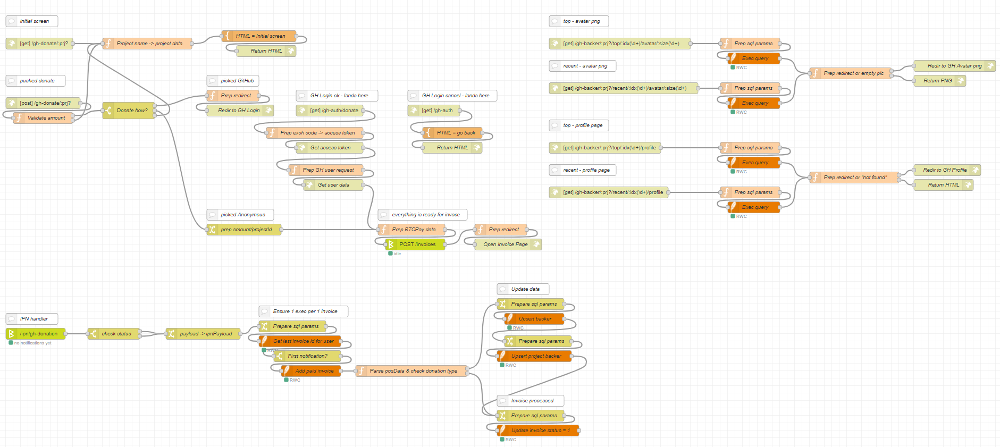

This flow creates a donation page where GitHub users can make Bitcoin donations and automatically get added to Backers lists on your GitHub repo's readme, docs and homepage.

Other features include:

- Multiple projects with separate lists of backers, using a single BTCPay Server store
- Backers lists can be sorted by donation amount or time
- Avatar sizes customizable via url
- Anonymous donations without GitHub account

## Live Demo

To see GitHub Donations in action, check Backers sections on [Red BTC homepage](https://redbtc.org) and [BTCPay Nodes repo](https://github.com/redbtc/node-red-contrib-btcpay).

## Prerequisites

This flow requires the following nodes to be installed on your Node-RED:

- [node-red-node-sqlite](https://flows.nodered.org/node/node-red-node-sqlite)
- [node-red-contrib-credentials](https://flows.nodered.org/node/node-red-contrib-credentials)

To enable GitHub user authentication, you need to [register a new OAuth application](https://github.com/settings/applications/new) on GitHub:

- **Application name** - app name (visible on the GitHub login screen)
- **Homepage URL** - homepage url (visible on the GitHub login screen)
- **Authorization callback URL** - set **&lt;your-node-red-url&gt;/gh-auth**. For example, if your Node-RED instance is running on `https://mynode.mydomain.com`, then the url will be `https://mynode.mydomain.com/gh-auth`
- Register app and optionally upload your app logo. On the same page you'll find **Client ID** and **Client Secret**, which will be required later on the flow configuration stage.

## Configuration & Setup

1. Import the Node-RED Flow - it will add a new tab called "GH Donations"
2. Open the "Configuration nodes" panel in Node-RED (via tabs on the right panel or `ctrl-g c` shortcut) and configure the config-nodes:
    - **btcpay-api-config** - create a store on your BTCPay Server and pair the node with it ([read more](/docs/configuration))
    - **sqlitedb** - set a path to a SQLite DB file where the app will store the data
3. In the "IPN Handler" section (bottom-left corner) of the tab double-click the initial node and specify URL for receiving POST notifications from BTCPay Server
4. In the "App Configuration & Setup" section (top-left corner) of the flow double-click the "🔨 App Settings" node and enter your data:
    - **nrRootUrl** - root URL of your Node-RED instance, without slash at the end. For example, `https://mynode.mydomain.com`
    - **ghUserAgent** - GitHub requires some user agent to execute API requests. Enter some id for your app. For example, **my-donation-app**
    - **nrIPNUrl** - URL the IPN handler is running on. For example, if you set **/ipn/gh-donation** on the step 3 and your Node-RED instance is running on `https://mynode.mydomain.com`, then the IPN url will be `https://mynode.mydomain.com/ipn/gh-donation`
    - `Done`
5. Double-click the "🔨 GH App Credentials" node and enter your GitHub App data:
    - **ghAppClientId** - put **Client ID** of your GitHub application
    - **ghAppClientSecret** - put **Client Secret** of your GitHub application
    - `Done`
6. Double-click the "🔨 Project data" node and enter data about your projects:
    - **project name** - is a text id for donation page and backer URLs. The *default* is used when requested donation/backer url doesn't have project name or if the specified project name doesn't exist. If you have only one repository, or if you want only one backers list for all of your repositories, then simply use the *default* project. If you want to separate your backers by projects/repositories, then add more project objects with unique names.
    - **project object**:
        - **id** - unique number the project will have in DB
        - **title** - project title for the donation page
        - **perk** - text under the "Donate as GitHub User" button on the donation page
    - `Done`
7. Push `Deploy`
8. In the "App Configuration & Setup" section (top-left corner) of the flow click the injector buttons of "Auto-exec on startup" and "Setup App" nodes
9. Done! Your GitHub Donations is ready to be used.

## Donation Page & Backer Avatars/Links

Donation page:

- **&lt;your-node-red-url&gt;/gh-donate** - opens the donation page for the **default** project
- **&lt;your-node-red-url&gt;/gh-donate/&lt;prj-name&gt;** - opens the donation page for the **&lt;prj-name&gt;** project

Backer avatars:

- Sorted by the donation amount:
    - **&lt;your-node-red-url&gt;/gh-backer/top/&lt;idx&gt;/avatar/&lt;size&gt;** - redirects to GitHub avatar of the backer #**&lt;idx&gt;** (starting from zero) for the **default** project. The &lt;size&gt;** specifies the avatar size in pixels.
    - **&lt;your-node-red-url&gt;/gh-backer/&lt;prj-name&gt;/top/&lt;idx&gt;/avatar/&lt;size&gt;** - redirects to GitHub avatar of the backer #**&lt;idx&gt;** (starting from zero) for the **&lt;prj-name&gt;** project. The &lt;size&gt;** specifies the avatar size in pixels.
- Sorted by the last donation time:
    - **&lt;your-node-red-url&gt;/gh-backer/recent/&lt;idx&gt;/avatar/&lt;size&gt;** - redirects to GitHub avatar of the backer #**&lt;idx&gt;** (starting from zero) for the **default** project. The &lt;size&gt;** specifies the avatar size in pixels.
    - **&lt;your-node-red-url&gt;/gh-backer/&lt;prj-name&gt;/recent/&lt;idx&gt;/avatar/&lt;size&gt;** - redirects to GitHub avatar of the backer #**&lt;idx&gt;** (starting from zero) for the **&lt;prj-name&gt;** project. The &lt;size&gt;** specifies the avatar size in pixels.

Backer profiles on GitHub:

- Sorted by the donation amount:
    - **&lt;your-node-red-url&gt;/gh-backer/top/&lt;idx&gt;/profile** - redirects to GitHub profile of the backer #**&lt;idx&gt;** (starting from zero) for the **default** project
    - **&lt;your-node-red-url&gt;/gh-backer/&lt;prj-name&gt;/top/&lt;idx&gt;/profile** - redirects to GitHub avatar of the backer #**&lt;idx&gt;** (starting from zero) for the **&lt;prj-name&gt;** project
- Sorted by the last donation time:
    - **&lt;your-node-red-url&gt;/gh-backer/recent/&lt;idx&gt;/profile** - redirects to GitHub profile of the backer #**&lt;idx&gt;** (starting from zero) for the **default** project
    - **&lt;your-node-red-url&gt;/gh-backer/&lt;prj-name&gt;/recent/&lt;idx&gt;/profile** - redirects to GitHub avatar of the backer #**&lt;idx&gt;** (starting from zero) for the **&lt;prj-name&gt;** project

## Backers List

A backers list can be created by combining the above-mentioned links, and placed on a GitHub repo's readme or any static webpage. Here is an example markdown for a "Top 10 Backers" list with `60x60` avatars for `default` project, when Node-RED instance is hosted on `https://mynode.mydomain.com`:

```markdown
## Our Backers

[[Become a backer](https://mynode.mydomain.com/gh-donate)]

[](https://mynode.mydomain.com/gh-backer/top/0/profile)
[](https://mynode.mydomain.com/gh-backer/top/1/profile)
[](https://mynode.mydomain.com/gh-backer/top/2/profile)
[](https://mynode.mydomain.com/gh-backer/top/3/profile)
[](https://mynode.mydomain.com/gh-backer/top/4/profile)
[](https://mynode.mydomain.com/gh-backer/top/5/profile)
[](https://mynode.mydomain.com/gh-backer/top/6/profile)
[](https://mynode.mydomain.com/gh-backer/top/7/profile)
[](https://mynode.mydomain.com/gh-backer/top/8/profile)
[](https://mynode.mydomain.com/gh-backer/top/9/profile)
```


## Node-RED Flow



```
[
    {
        "id": "714cb193.73b65",
        "type": "tab",
        "label": "GH Donations",
        "disabled": false,
        "info": ""
    },
    {
        "id": "4a50fb7.983fc04",
        "type": "btcpay-ipn",
        "z": "714cb193.73b65",
        "client": "bfda6f6c.3d851",
        "path": "/ipn/gh-donation",
        "name": "",
        "x": 160,
        "y": 1460,
        "wires": [
            [
                "826fffce.750ed"
            ]
        ]
    },
    {
        "id": "826fffce.750ed",
        "type": "switch",
        "z": "714cb193.73b65",
        "name": "check status",
        "property": "payload.status",
        "propertyType": "msg",
        "rules": [
            {
                "t": "eq",
                "v": "confirmed",
                "vt": "str"
            },
            {
                "t": "eq",
                "v": "complete",
                "vt": "str"
            }
        ],
        "checkall": "false",
        "repair": false,
        "outputs": 2,
        "x": 370,
        "y": 1460,
        "wires": [
            [
                "a4eee0ca.13628"
            ],
            [
                "a4eee0ca.13628"
            ]
        ]
    },
    {
        "id": "b0268e6e.28541",
        "type": "template",
        "z": "714cb193.73b65",
        "name": "SQL Query = Setup Tables",
        "field": "topic",
        "fieldType": "msg",
        "format": "sql",
        "syntax": "plain",
        "template": "CREATE TABLE IF NOT EXISTS backers (\n    id INTEGER PRIMARY KEY, /* github user id */\n    name TEXT NOT NULL /* github user name */\n);\n\nCREATE TABLE IF NOT EXISTS project_backers (\n    project_id INTEGER NOT NULL, /* project id */\n    backer_id INTEGER NOT NULL, /* backer id */\n    sats INTEGER NOT NULL, /* total sats paid = sum of all paid invoices */    \n    created_at INTEGER NOT NULL, /* row creation timestamp */\n    paid_at INTEGER NOT NULL, /* last payment timestamp */\n    PRIMARY KEY (project_id, backer_id)\n);\n\nCREATE INDEX IF NOT EXISTS idx_project_backers_backer\n    ON project_backers (backer_id);\n\nCREATE INDEX IF NOT EXISTS idx_project_backers_sats_project\n    ON project_backers (sats, project_id);\n\nCREATE INDEX IF NOT EXISTS idx_project_backers_paid_at_project\n    ON project_backers (paid_at, project_id);\n\nCREATE TABLE IF NOT EXISTS paid_invoices (\n    id TEXT PRIMARY KEY, /* btcpay invoice id */\n    status INTEGER NOT NULL /* 0 - not processed, 1 - processed */\n);",
        "output": "str",
        "x": 480,
        "y": 300,
        "wires": [
            [
                "8dad9180.3c461"
            ]
        ]
    },
    {
        "id": "8dad9180.3c461",
        "type": "sqlite",
        "z": "714cb193.73b65",
        "mydb": "60317d5d.ef5804",
        "sqlquery": "batch",
        "sql": "",
        "name": "Exec query",
        "x": 530,
        "y": 340,
        "wires": [
            []
        ]
    },
    {
        "id": "d5d0a62.9eba158",
        "type": "inject",
        "z": "714cb193.73b65",
        "name": "Setup App",
        "props": [
            {
                "p": "payload"
            },
            {
                "p": "topic",
                "vt": "str"
            }
        ],
        "repeat": "",
        "crontab": "",
        "once": false,
        "onceDelay": 0.1,
        "topic": "",
        "payload": "",
        "payloadType": "date",
        "x": 160,
        "y": 300,
        "wires": [
            [
                "b0268e6e.28541"
            ]
        ]
    },
    {
        "id": "5bc84095.a1afc",
        "type": "comment",
        "z": "714cb193.73b65",
        "name": "App Configuration & Setup",
        "info": "",
        "x": 190,
        "y": 80,
        "wires": []
    },
    {
        "id": "4790a696.70c858",
        "type": "http in",
        "z": "714cb193.73b65",
        "name": "",
        "url": "/gh-auth",
        "method": "get",
        "upload": false,
        "swaggerDoc": "",
        "x": 1230,
        "y": 860,
        "wires": [
            [
                "407eac4e.cccbe4"
            ]
        ]
    },
    {
        "id": "b3aa6360.316c6",
        "type": "http response",
        "z": "714cb193.73b65",
        "name": "Return HTML",
        "statusCode": "",
        "headers": {
            "content-type": "text/html"
        },
        "x": 1280,
        "y": 960,
        "wires": []
    },
    {
        "id": "b051aa89.25d938",
        "type": "comment",
        "z": "714cb193.73b65",
        "name": "GH Login cancel - lands here",
        "info": "Could be only open when the user cancels GH authentication.",
        "x": 1280,
        "y": 820,
        "wires": []
    },
    {
        "id": "787aa2f7.8a5b3c",
        "type": "http in",
        "z": "714cb193.73b65",
        "name": "",
        "url": "/gh-auth/donate",
        "method": "get",
        "upload": false,
        "swaggerDoc": "",
        "x": 950,
        "y": 860,
        "wires": [
            [
                "2969f0aa.6ef8b"
            ]
        ]
    },
    {
        "id": "93971ab7.e55668",
        "type": "http in",
        "z": "714cb193.73b65",
        "name": "",
        "url": "/gh-donate/:prj?",
        "method": "get",
        "upload": false,
        "swaggerDoc": "",
        "x": 170,
        "y": 680,
        "wires": [
            [
                "9612e1b5.3883e"
            ]
        ]
    },
    {
        "id": "dfe29668.3ed558",
        "type": "http response",
        "z": "714cb193.73b65",
        "name": "Return HTML",
        "statusCode": "",
        "headers": {
            "content-type": "text/html"
        },
        "x": 780,
        "y": 700,
        "wires": []
    },
    {
        "id": "9612e1b5.3883e",
        "type": "function",
        "z": "714cb193.73b65",
        "name": "Project name -> project data",
        "func": "const projectMap = flow.get(\"projectMap\");\n\nmsg.project = (msg.req.params.prj && projectMap[msg.req.params.prj]) || projectMap.default;\n\nreturn msg;",
        "outputs": 1,
        "noerr": 0,
        "initialize": "",
        "finalize": "",
        "x": 460,
        "y": 680,
        "wires": [
            [
                "b3d05ff4.8c498"
            ]
        ]
    },
    {
        "id": "b3d05ff4.8c498",
        "type": "template",
        "z": "714cb193.73b65",
        "name": "HTML = Initial screen",
        "field": "payload",
        "fieldType": "msg",
        "format": "handlebars",
        "syntax": "mustache",
        "template": "<!DOCTYPE html>\n<html>\n  <head>\n    <meta name=\"viewport\" content=\"width=device-width, initial-scale=1\" />\n    <link\n      rel=\"stylesheet\"\n      href=\"https://stackpath.bootstrapcdn.com/bootstrap/4.4.1/css/bootstrap.min.css\"\n      integrity=\"sha384-Vkoo8x4CGsO3+Hhxv8T/Q5PaXtkKtu6ug5TOeNV6gBiFeWPGFN9MuhOf23Q9Ifjh\"\n      crossorigin=\"anonymous\"\n    />\n    <title>Support {{project.title}} with your donation</title>\n\n    <style>\n      body,\n      html {\n        height: 100%;\n        background-color: #f5f5f5;\n      }\n      body {\n        display: flex;\n      }\n      html {\n        font-size: 14px;\n      }\n      .display-4 {\n        font-size: 3rem;\n      }\n      @media (min-width: 768px) {\n        html {\n          font-size: 16px;\n        }\n        .display-4 {\n          font-size: 3.5rem;\n        }\n      }\n\n      .cover-container {\n        max-width: 42em;\n      }\n      .card-deck {\n        display: grid;\n        grid-template-columns: repeat(auto-fit, minmax(250px, 1fr));\n        grid-gap: 0.5rem;\n      }\n\n      .card-deck .card:only-of-type {\n        max-width: 320px;\n        margin: auto;\n      }\n    </style>\n  </head>\n  <body>\n    <div\n      class=\"text-center cover-container d-flex w-100 h-100 p-3 mx-auto flex-column\"\n    >\n      <main\n        class=\"justify-content-center align-self-center text-center mx-auto px-2 py-3 w-100\"\n        style=\"margin: auto\"\n      >\n        <h1 class=\"display-4 mb-5\">\n          Support {{project.title}} with your donation\n        </h1>\n        <div class=\"row card-deck mb-3 text-center\">\n          <div class=\"card mb-4 shadow-sm\">\n            <div class=\"card-header\">\n              <h4 class=\"my-0 font-weight-normal\">Bitcoin Donation</h4>\n            </div>\n            <div class=\"card-body\">\n              <form method=\"post\" action=\"\">\n                <input type=\"hidden\" name=\"projectId\" value=\"{{project.id}}\" />\n                <div class=\"form-group\">\n                  <div class=\"input-group\">\n                    <div class=\"input-group-prepend\">\n                      <span class=\"input-group-text\">&#x20BF;</span>\n                    </div>\n                    <input\n                      class=\"form-control\"\n                      type=\"number\"\n                      min=\"0\"\n                      step=\"0.0001\"\n                      name=\"amount\"\n                      placeholder=\"Amount in Bitcoin\"\n                    />\n                  </div>\n                </div>\n                <div class=\"form-group\">\n                  <button\n                    class=\"btn btn-primary btn-block\"\n                    type=\"submit\"\n                    name=\"donate\"\n                    value=\"github\"\n                  >\n                    Donate as GitHub User\n                  </button>\n                  <small id=\"ghHelp\" class=\"form-text text-muted\">\n                    {{project.perk}}\n                  </small>\n                </div>\n                <div>\n                  <button\n                    class=\"btn btn-outline-primary btn-block\"\n                    type=\"submit\"\n                    name=\"donate\"\n                    value=\"anonymous\"\n                  >\n                    Donate Anonymously\n                  </button>\n                  <small id=\"ghHelp\" class=\"form-text text-muted\">\n                    No one will know who made the donation.\n                  </small>\n                </div>\n              </form>\n            </div>\n          </div>\n        </div>\n      </main>\n    </div>\n  </body>\n</html>\n",
        "output": "str",
        "x": 760,
        "y": 660,
        "wires": [
            [
                "dfe29668.3ed558"
            ]
        ]
    },
    {
        "id": "f05703ab.3b074",
        "type": "http in",
        "z": "714cb193.73b65",
        "name": "",
        "url": "/gh-donate/:prj?",
        "method": "post",
        "upload": false,
        "swaggerDoc": "",
        "x": 180,
        "y": 840,
        "wires": [
            [
                "58c25637.3194c8"
            ]
        ]
    },
    {
        "id": "58c25637.3194c8",
        "type": "function",
        "z": "714cb193.73b65",
        "name": "Validate amount",
        "func": "const amt = (msg.payload.amount * 1) || 0;\nif(amt > 0) {\n    return [msg];\n} else {\n    return [null, msg];\n}\n",
        "outputs": 2,
        "noerr": 0,
        "initialize": "",
        "finalize": "",
        "x": 180,
        "y": 880,
        "wires": [
            [
                "6910e6d.0229218"
            ],
            [
                "9612e1b5.3883e"
            ]
        ],
        "outputLabels": [
            "> 0",
            "<= 0"
        ]
    },
    {
        "id": "517c7ff4.817fe",
        "type": "http response",
        "z": "714cb193.73b65",
        "name": "Redir to GH Login",
        "statusCode": "",
        "headers": {
            "content-type": "text/html"
        },
        "x": 710,
        "y": 860,
        "wires": []
    },
    {
        "id": "61e934d1.4c4a7c",
        "type": "function",
        "z": "714cb193.73b65",
        "name": "Prep redirect",
        "func": "const clientId = flow.get(\"ghAppClientId\");\nconst rootUrl = flow.get(\"nrRootUrl\");\nconst redirectUri = encodeURIComponent(`${rootUrl}/gh-auth/donate?projectId=${msg.payload.projectId}&amount=${msg.payload.amount}`);\nmsg.statusCode = 303;\nmsg.headers = {\n    Location: \"https://github.com/login/oauth/authorize?client_id=\" + clientId + \"&redirect_uri=\" + redirectUri\n}\ndelete msg.payload;\n\nreturn msg;",
        "outputs": 1,
        "noerr": 0,
        "initialize": "",
        "finalize": "",
        "x": 690,
        "y": 820,
        "wires": [
            [
                "517c7ff4.817fe"
            ]
        ]
    },
    {
        "id": "6910e6d.0229218",
        "type": "switch",
        "z": "714cb193.73b65",
        "name": "Donate how?",
        "property": "payload.donate",
        "propertyType": "msg",
        "rules": [
            {
                "t": "eq",
                "v": "github",
                "vt": "str"
            },
            {
                "t": "eq",
                "v": "anonymous",
                "vt": "str"
            },
            {
                "t": "else"
            }
        ],
        "checkall": "false",
        "repair": false,
        "outputs": 3,
        "x": 410,
        "y": 860,
        "wires": [
            [
                "61e934d1.4c4a7c"
            ],
            [
                "112a8eb0.dc5c61"
            ],
            [
                "9612e1b5.3883e"
            ]
        ]
    },
    {
        "id": "407eac4e.cccbe4",
        "type": "template",
        "z": "714cb193.73b65",
        "name": "HTML = go back",
        "field": "payload",
        "fieldType": "msg",
        "format": "handlebars",
        "syntax": "mustache",
        "template": "You haven't authorized the app to access your GitHub public info. <a href=\"javascript:history.back()\">Go Back</a> and try again.\nOr <a href=\"javascript:history.go(-2)\">Go Back twice</a> and select &laquo;Donate Anonymously&raquo;.",
        "output": "str",
        "x": 1280,
        "y": 920,
        "wires": [
            [
                "b3aa6360.316c6"
            ]
        ]
    },
    {
        "id": "b2eb7de8.570dd",
        "type": "comment",
        "z": "714cb193.73b65",
        "name": "GH Login ok - lands here",
        "info": "Opens when the user pushed Donate as GH user and auths.",
        "x": 970,
        "y": 820,
        "wires": []
    },
    {
        "id": "b00dae85.7ffed",
        "type": "comment",
        "z": "714cb193.73b65",
        "name": "initial screen",
        "info": "Opens when the user pushed Donate as GH user and auths.",
        "x": 150,
        "y": 620,
        "wires": []
    },
    {
        "id": "cda8519e.cf5f",
        "type": "comment",
        "z": "714cb193.73b65",
        "name": "pushed donate",
        "info": "Opens when the user pushed Donate as GH user and auths.",
        "x": 160,
        "y": 780,
        "wires": []
    },
    {
        "id": "2969f0aa.6ef8b",
        "type": "function",
        "z": "714cb193.73b65",
        "name": "Prep exch code -> access token",
        "func": "const clientId = flow.get(\"ghAppClientId\");\nconst clientSecret = flow.get(\"ghAppClientSecret\");\n\nmsg.amount = msg.payload.amount;\nmsg.projectId = msg.payload.projectId;\n\nmsg.headers = {\n    \"Accept\": \"application/json\"\n}\nmsg.payload = {\n    client_id: clientId,\n    client_secret: clientSecret,\n    code: msg.payload.code\n}\n\nreturn msg;",
        "outputs": 1,
        "noerr": 0,
        "initialize": "",
        "finalize": "",
        "x": 910,
        "y": 920,
        "wires": [
            [
                "243ae003.28d35"
            ]
        ]
    },
    {
        "id": "89ed48da.cf49b8",
        "type": "inject",
        "z": "714cb193.73b65",
        "name": "Auto-exec on startup",
        "props": [
            {
                "p": "payload"
            },
            {
                "p": "topic",
                "vt": "str"
            }
        ],
        "repeat": "",
        "crontab": "",
        "once": true,
        "onceDelay": "0",
        "topic": "",
        "payload": "",
        "payloadType": "date",
        "x": 200,
        "y": 160,
        "wires": [
            [
                "372faf30.1f5ec"
            ]
        ]
    },
    {
        "id": "372faf30.1f5ec",
        "type": "change",
        "z": "714cb193.73b65",
        "name": "🔨 App Settings",
        "rules": [
            {
                "t": "set",
                "p": "nrRootUrl",
                "pt": "flow",
                "to": "https://mynode.mydomain.com",
                "tot": "str"
            },
            {
                "t": "set",
                "p": "nrIPNUrl",
                "pt": "flow",
                "to": "https://mynode.mydomain.com/ipn/gh-donation",
                "tot": "str"
            },
            {
                "t": "set",
                "p": "ghUserAgent",
                "pt": "flow",
                "to": "my-donation-app",
                "tot": "str"
            }
        ],
        "action": "",
        "property": "",
        "from": "",
        "to": "",
        "reg": false,
        "x": 440,
        "y": 160,
        "wires": [
            [
                "6e43b7a1.93dab8"
            ]
        ]
    },
    {
        "id": "6e43b7a1.93dab8",
        "type": "credentials",
        "z": "714cb193.73b65",
        "name": "🔨 GH App Credentials",
        "props": [
            {
                "value": "ghAppClientId",
                "type": "flow"
            },
            {
                "value": "ghAppClientSecret",
                "type": "flow"
            }
        ],
        "x": 470,
        "y": 200,
        "wires": [
            [
                "4b5fc225.1c8c3c"
            ]
        ]
    },
    {
        "id": "4b5fc225.1c8c3c",
        "type": "function",
        "z": "714cb193.73b65",
        "name": "🔨 Project data",
        "func": "const projectMap = {\n    // default is used when requested donation/backer url doesn't have project name or if the specified project name doesn't exist\n    \"default\": { // project name for donation page urls\n        id: 0, // project id for DB\n        title: \"My Work\", // project title for donation page\n        perk: \"Your GitHub avatar and link will be published on my repo\" // perk for gh user backers (shown on donation page)\n    },\n    // \"my-repo\": {\n    //     id: 1,\n    //     title: \"My Repo\",\n    //     perk: \"You will be mentioned as a backer on Readme of My Repo\"\n    // },\n    // \"another-repo\": {\n    //     id: 2,\n    //     title: \"Another Repo\",\n    //     perk: \"You will be mentioned as a backer on Readme of Another Repo\"\n    // },\n}\n\nflow.set(\"projectMap\", projectMap);\n\nreturn msg;",
        "outputs": 1,
        "noerr": 0,
        "initialize": "",
        "finalize": "",
        "x": 440,
        "y": 240,
        "wires": [
            []
        ]
    },
    {
        "id": "243ae003.28d35",
        "type": "http request",
        "z": "714cb193.73b65",
        "name": "Get access token",
        "method": "POST",
        "ret": "obj",
        "paytoqs": "ignore",
        "url": "https://github.com/login/oauth/access_token",
        "tls": "",
        "persist": false,
        "proxy": "",
        "authType": "",
        "x": 950,
        "y": 960,
        "wires": [
            [
                "9a7e9fea.9c964"
            ]
        ]
    },
    {
        "id": "9a7e9fea.9c964",
        "type": "function",
        "z": "714cb193.73b65",
        "name": "Prep GH user request",
        "func": "const accessToken = msg.payload.access_token;\nconst userAgent = flow.get(\"ghUserAgent\") || \"my-donation-app\";\n\nmsg.headers = {\n    \"Accept\": \"application/json\",\n    \"Authorization\": \"token \" + accessToken,\n    \"User-Agent\": userAgent\n}\n\ndelete msg.payload;\n\nreturn msg;",
        "outputs": 1,
        "noerr": 0,
        "initialize": "",
        "finalize": "",
        "x": 940,
        "y": 1020,
        "wires": [
            [
                "1e0e4541.76bd0b"
            ]
        ]
    },
    {
        "id": "1e0e4541.76bd0b",
        "type": "http request",
        "z": "714cb193.73b65",
        "name": "Get user data",
        "method": "GET",
        "ret": "obj",
        "paytoqs": "ignore",
        "url": "https://api.github.com/user",
        "tls": "",
        "persist": false,
        "proxy": "",
        "authType": "",
        "x": 960,
        "y": 1060,
        "wires": [
            [
                "dab31abd.ac5138"
            ]
        ]
    },
    {
        "id": "dab31abd.ac5138",
        "type": "function",
        "z": "714cb193.73b65",
        "name": "Prep BTCPay data",
        "func": "const notificationURL = flow.get(\"nrIPNUrl\");\nconst posData = JSON.stringify({\n    projectId: msg.projectId,\n    ghId: msg.payload.id,\n    ghName: msg.payload.login\n})\n\nmsg.payload = {\n    price: msg.amount,\n    currency: \"BTC\",\n    notificationURL,\n    posData\n}\n\nreturn msg;",
        "outputs": 1,
        "noerr": 0,
        "initialize": "",
        "finalize": "",
        "x": 1170,
        "y": 1180,
        "wires": [
            [
                "c388dc0e.a83a5"
            ]
        ]
    },
    {
        "id": "c388dc0e.a83a5",
        "type": "btcpay-api",
        "z": "714cb193.73b65",
        "method": "POST",
        "path": "/invoices",
        "client": "bfda6f6c.3d851",
        "name": "",
        "x": 1180,
        "y": 1220,
        "wires": [
            [
                "d207f596.a67718"
            ]
        ]
    },
    {
        "id": "d207f596.a67718",
        "type": "function",
        "z": "714cb193.73b65",
        "name": "Prep redirect",
        "func": "msg.statusCode = 303;\nmsg.headers = {\n    Location: msg.payload.url\n}\ndelete msg.payload;\n\nreturn msg;",
        "outputs": 1,
        "noerr": 0,
        "initialize": "",
        "finalize": "",
        "x": 1410,
        "y": 1180,
        "wires": [
            [
                "94db9b0b.149928"
            ]
        ]
    },
    {
        "id": "94db9b0b.149928",
        "type": "http response",
        "z": "714cb193.73b65",
        "name": "Open Invoice Page",
        "statusCode": "",
        "headers": {
            "content-type": "text/html"
        },
        "x": 1430,
        "y": 1220,
        "wires": []
    },
    {
        "id": "112a8eb0.dc5c61",
        "type": "change",
        "z": "714cb193.73b65",
        "name": "prep amount/projectId",
        "rules": [
            {
                "t": "move",
                "p": "payload.amount",
                "pt": "msg",
                "to": "amount",
                "tot": "msg"
            },
            {
                "t": "move",
                "p": "payload.projectId",
                "pt": "msg",
                "to": "projectId",
                "tot": "msg"
            }
        ],
        "action": "",
        "property": "",
        "from": "",
        "to": "",
        "reg": false,
        "x": 720,
        "y": 1180,
        "wires": [
            [
                "dab31abd.ac5138"
            ]
        ]
    },
    {
        "id": "7ba169fd.24dbd8",
        "type": "comment",
        "z": "714cb193.73b65",
        "name": "picked GitHub",
        "info": "Opens when the user pushed Donate as GH user and auths.",
        "x": 690,
        "y": 780,
        "wires": []
    },
    {
        "id": "166780fa.c23e5f",
        "type": "comment",
        "z": "714cb193.73b65",
        "name": "picked Anonymous",
        "info": "Opens when the user pushed Donate as GH user and auths.",
        "x": 710,
        "y": 1140,
        "wires": []
    },
    {
        "id": "c80dfb4b.ce3b58",
        "type": "comment",
        "z": "714cb193.73b65",
        "name": "everything is ready for invoce",
        "info": "Opens when the user pushed Donate as GH user and auths.",
        "x": 1200,
        "y": 1140,
        "wires": []
    },
    {
        "id": "b44ff0d4.9778d",
        "type": "comment",
        "z": "714cb193.73b65",
        "name": "IPN handler",
        "info": "Opens when the user pushed Donate as GH user and auths.",
        "x": 150,
        "y": 1420,
        "wires": []
    },
    {
        "id": "a6f02fb5.bd441",
        "type": "function",
        "z": "714cb193.73b65",
        "name": "Parse posData & check donation type",
        "func": "msg.posData = JSON.parse(msg.ipnPayload.posData);\n\nif (msg.posData.ghId && msg.posData.ghName) {\n    return [msg];\n} else {\n    return [null, msg];\n}\n",
        "outputs": 2,
        "noerr": 0,
        "initialize": "",
        "finalize": "",
        "x": 1170,
        "y": 1560,
        "wires": [
            [
                "fb1ce918.8168d8"
            ],
            [
                "ff5d0eda.d4b14"
            ]
        ],
        "outputLabels": [
            "GitHub user",
            "Anonymous"
        ]
    },
    {
        "id": "2e942879.2968a8",
        "type": "change",
        "z": "714cb193.73b65",
        "name": "Prepare sql params",
        "rules": [
            {
                "t": "set",
                "p": "params.$iid",
                "pt": "msg",
                "to": "ipnPayload.id",
                "tot": "msg"
            }
        ],
        "action": "",
        "property": "",
        "from": "",
        "to": "",
        "reg": false,
        "x": 850,
        "y": 1440,
        "wires": [
            [
                "47925fa0.a4a67"
            ]
        ]
    },
    {
        "id": "47925fa0.a4a67",
        "type": "sqlite",
        "z": "714cb193.73b65",
        "mydb": "60317d5d.ef5804",
        "sqlquery": "prepared",
        "sql": "SELECT * FROM paid_invoices WHERE id = $iid;",
        "name": "Get last invoice id for user",
        "x": 870,
        "y": 1480,
        "wires": [
            [
                "87a0f7dd.c5c858"
            ]
        ]
    },
    {
        "id": "87a0f7dd.c5c858",
        "type": "switch",
        "z": "714cb193.73b65",
        "name": "First notification?",
        "property": "payload",
        "propertyType": "msg",
        "rules": [
            {
                "t": "empty"
            }
        ],
        "checkall": "false",
        "repair": false,
        "outputs": 1,
        "x": 890,
        "y": 1520,
        "wires": [
            [
                "36d9a02b.f873c"
            ]
        ],
        "outputLabels": [
            "Yes"
        ]
    },
    {
        "id": "a4eee0ca.13628",
        "type": "change",
        "z": "714cb193.73b65",
        "name": "payload -> ipnPayload",
        "rules": [
            {
                "t": "move",
                "p": "payload",
                "pt": "msg",
                "to": "ipnPayload",
                "tot": "msg"
            }
        ],
        "action": "",
        "property": "",
        "from": "",
        "to": "",
        "reg": false,
        "x": 610,
        "y": 1460,
        "wires": [
            [
                "2e942879.2968a8"
            ]
        ]
    },
    {
        "id": "36d9a02b.f873c",
        "type": "sqlite",
        "z": "714cb193.73b65",
        "mydb": "60317d5d.ef5804",
        "sqlquery": "prepared",
        "sql": "INSERT INTO paid_invoices(id, status)\n       VALUES($iid, 0);",
        "name": "Add paid invoice",
        "x": 900,
        "y": 1560,
        "wires": [
            [
                "a6f02fb5.bd441"
            ]
        ]
    },
    {
        "id": "ff5d0eda.d4b14",
        "type": "change",
        "z": "714cb193.73b65",
        "name": "Prepare sql params",
        "rules": [
            {
                "t": "delete",
                "p": "params",
                "pt": "msg"
            },
            {
                "t": "set",
                "p": "params.$iid",
                "pt": "msg",
                "to": "ipnPayload.id",
                "tot": "msg"
            }
        ],
        "action": "",
        "property": "",
        "from": "",
        "to": "",
        "reg": false,
        "x": 1490,
        "y": 1680,
        "wires": [
            [
                "64e4495b.5c2258"
            ]
        ]
    },
    {
        "id": "64e4495b.5c2258",
        "type": "sqlite",
        "z": "714cb193.73b65",
        "mydb": "60317d5d.ef5804",
        "sqlquery": "prepared",
        "sql": "UPDATE paid_invoices SET status = 1 WHERE id = $iid;\n",
        "name": "Update invoice status = 1",
        "x": 1510,
        "y": 1720,
        "wires": [
            []
        ]
    },
    {
        "id": "a59a567c.a11e18",
        "type": "comment",
        "z": "714cb193.73b65",
        "name": "Ensure 1 exec per 1 invoice",
        "info": "",
        "x": 880,
        "y": 1400,
        "wires": []
    },
    {
        "id": "d2b8c627.baba58",
        "type": "comment",
        "z": "714cb193.73b65",
        "name": "Invoice processed",
        "info": "",
        "x": 1490,
        "y": 1640,
        "wires": []
    },
    {
        "id": "fb1ce918.8168d8",
        "type": "change",
        "z": "714cb193.73b65",
        "name": "Prepare sql params",
        "rules": [
            {
                "t": "delete",
                "p": "params",
                "pt": "msg"
            },
            {
                "t": "set",
                "p": "params.$id",
                "pt": "msg",
                "to": "posData.ghId",
                "tot": "msg"
            },
            {
                "t": "set",
                "p": "params.$name",
                "pt": "msg",
                "to": "posData.ghName",
                "tot": "msg"
            }
        ],
        "action": "",
        "property": "",
        "from": "",
        "to": "",
        "reg": false,
        "x": 1490,
        "y": 1380,
        "wires": [
            [
                "8c5d694c.6647c8"
            ]
        ]
    },
    {
        "id": "8c5d694c.6647c8",
        "type": "sqlite",
        "z": "714cb193.73b65",
        "mydb": "60317d5d.ef5804",
        "sqlquery": "prepared",
        "sql": "INSERT INTO backers (\n    id,\n    name\n) VALUES($id,$name)\nON CONFLICT (id) DO UPDATE SET name=excluded.name;\n",
        "name": "Upsert backer",
        "x": 1500,
        "y": 1420,
        "wires": [
            [
                "3c043297.4f0e4e"
            ]
        ]
    },
    {
        "id": "3c043297.4f0e4e",
        "type": "change",
        "z": "714cb193.73b65",
        "name": "Prepare sql params",
        "rules": [
            {
                "t": "delete",
                "p": "params",
                "pt": "msg"
            },
            {
                "t": "set",
                "p": "params.$pid",
                "pt": "msg",
                "to": "posData.projectId",
                "tot": "msg"
            },
            {
                "t": "set",
                "p": "params.$bid",
                "pt": "msg",
                "to": "posData.ghId",
                "tot": "msg"
            },
            {
                "t": "set",
                "p": "params.$sats",
                "pt": "msg",
                "to": "$number(ipnPayload.btcPaid) * 100000000",
                "tot": "jsonata"
            },
            {
                "t": "set",
                "p": "params.$time",
                "pt": "msg",
                "to": "",
                "tot": "date"
            }
        ],
        "action": "",
        "property": "",
        "from": "",
        "to": "",
        "reg": false,
        "x": 1510,
        "y": 1480,
        "wires": [
            [
                "566ea1cd.18d5c"
            ]
        ]
    },
    {
        "id": "566ea1cd.18d5c",
        "type": "sqlite",
        "z": "714cb193.73b65",
        "mydb": "60317d5d.ef5804",
        "sqlquery": "prepared",
        "sql": "INSERT INTO project_backers (\n    project_id,\n    backer_id,\n    sats,\n    created_at,\n    paid_at\n) VALUES($pid,$bid,$sats,$time,$time)\nON CONFLICT (project_id, backer_id)\nDO UPDATE SET\n    sats = sats+excluded.sats,\n    paid_at = excluded.paid_at;\n",
        "name": "Upsert project backer",
        "x": 1500,
        "y": 1520,
        "wires": [
            [
                "ff5d0eda.d4b14"
            ]
        ]
    },
    {
        "id": "b40e87bd.1434f8",
        "type": "comment",
        "z": "714cb193.73b65",
        "name": "Update data",
        "info": "",
        "x": 1470,
        "y": 1340,
        "wires": []
    },
    {
        "id": "64b01f0e.3be0a",
        "type": "comment",
        "z": "714cb193.73b65",
        "name": "Data Management",
        "info": "",
        "x": 1070,
        "y": 80,
        "wires": []
    },
    {
        "id": "6f0ae77f.f92428",
        "type": "inject",
        "z": "714cb193.73b65",
        "name": "Get all backers",
        "props": [],
        "repeat": "",
        "crontab": "",
        "once": false,
        "onceDelay": "0",
        "topic": "",
        "x": 1080,
        "y": 160,
        "wires": [
            [
                "dcd013ae.f90c2"
            ]
        ]
    },
    {
        "id": "dcd013ae.f90c2",
        "type": "sqlite",
        "z": "714cb193.73b65",
        "mydb": "60317d5d.ef5804",
        "sqlquery": "fixed",
        "sql": "SELECT * FROM backers;\n",
        "name": "Exec SQL Query",
        "x": 1330,
        "y": 160,
        "wires": [
            [
                "be4cd41b.6ea548"
            ]
        ]
    },
    {
        "id": "be4cd41b.6ea548",
        "type": "debug",
        "z": "714cb193.73b65",
        "name": "Output data",
        "active": true,
        "tosidebar": true,
        "console": false,
        "tostatus": false,
        "complete": "payload",
        "targetType": "msg",
        "statusVal": "",
        "statusType": "auto",
        "x": 1550,
        "y": 160,
        "wires": []
    },
    {
        "id": "4e21ce5a.2c4f4",
        "type": "inject",
        "z": "714cb193.73b65",
        "name": "Get all project backers",
        "props": [],
        "repeat": "",
        "crontab": "",
        "once": false,
        "onceDelay": "0",
        "topic": "",
        "x": 1100,
        "y": 220,
        "wires": [
            [
                "57903eb.234a0c"
            ]
        ]
    },
    {
        "id": "57903eb.234a0c",
        "type": "sqlite",
        "z": "714cb193.73b65",
        "mydb": "60317d5d.ef5804",
        "sqlquery": "fixed",
        "sql": "SELECT * FROM project_backers;\n",
        "name": "Exec SQL Query",
        "x": 1330,
        "y": 220,
        "wires": [
            [
                "35cf96fd.f92e2a"
            ]
        ]
    },
    {
        "id": "35cf96fd.f92e2a",
        "type": "debug",
        "z": "714cb193.73b65",
        "name": "Output data",
        "active": true,
        "tosidebar": true,
        "console": false,
        "tostatus": false,
        "complete": "payload",
        "targetType": "msg",
        "statusVal": "",
        "statusType": "auto",
        "x": 1550,
        "y": 220,
        "wires": []
    },
    {
        "id": "6e9a30bc.eae1c",
        "type": "inject",
        "z": "714cb193.73b65",
        "name": "Get all paid invoices",
        "props": [],
        "repeat": "",
        "crontab": "",
        "once": false,
        "onceDelay": "0",
        "topic": "",
        "x": 1090,
        "y": 280,
        "wires": [
            [
                "251a32fd.7a57de"
            ]
        ]
    },
    {
        "id": "251a32fd.7a57de",
        "type": "sqlite",
        "z": "714cb193.73b65",
        "mydb": "60317d5d.ef5804",
        "sqlquery": "fixed",
        "sql": "SELECT * FROM paid_invoices;\n",
        "name": "Exec SQL Query",
        "x": 1330,
        "y": 280,
        "wires": [
            [
                "ea188743.472908"
            ]
        ]
    },
    {
        "id": "ea188743.472908",
        "type": "debug",
        "z": "714cb193.73b65",
        "name": "Output data",
        "active": true,
        "tosidebar": true,
        "console": false,
        "tostatus": false,
        "complete": "payload",
        "targetType": "msg",
        "statusVal": "",
        "statusType": "auto",
        "x": 1550,
        "y": 280,
        "wires": []
    },
    {
        "id": "d2279a3a.7868d8",
        "type": "inject",
        "z": "714cb193.73b65",
        "d": true,
        "name": "Delete all paid invoices",
        "props": [],
        "repeat": "",
        "crontab": "",
        "once": false,
        "onceDelay": "0",
        "topic": "",
        "x": 1100,
        "y": 440,
        "wires": [
            [
                "6a5ce7e.2ef8818"
            ]
        ]
    },
    {
        "id": "6a5ce7e.2ef8818",
        "type": "sqlite",
        "z": "714cb193.73b65",
        "d": true,
        "mydb": "60317d5d.ef5804",
        "sqlquery": "fixed",
        "sql": "DELETE FROM paid_invoices;\n",
        "name": "Exec SQL Query",
        "x": 1330,
        "y": 440,
        "wires": [
            [
                "413c412c.3bc21"
            ]
        ]
    },
    {
        "id": "413c412c.3bc21",
        "type": "debug",
        "z": "714cb193.73b65",
        "d": true,
        "name": "Done",
        "active": true,
        "tosidebar": true,
        "console": false,
        "tostatus": false,
        "complete": "payload",
        "targetType": "msg",
        "statusVal": "",
        "statusType": "auto",
        "x": 1530,
        "y": 440,
        "wires": []
    },
    {
        "id": "4bb9b618.f47b68",
        "type": "inject",
        "z": "714cb193.73b65",
        "d": true,
        "name": "Delete all backers data",
        "props": [],
        "repeat": "",
        "crontab": "",
        "once": false,
        "onceDelay": "0",
        "topic": "",
        "x": 1100,
        "y": 400,
        "wires": [
            [
                "3dbb3b7d.038e04"
            ]
        ]
    },
    {
        "id": "7a1c2183.4fca8",
        "type": "sqlite",
        "z": "714cb193.73b65",
        "d": true,
        "mydb": "60317d5d.ef5804",
        "sqlquery": "batch",
        "sql": "DELETE FROM paid_invoices;\n",
        "name": "Exec SQL Query",
        "x": 1530,
        "y": 400,
        "wires": [
            [
                "f987ffac.5e369"
            ]
        ]
    },
    {
        "id": "f987ffac.5e369",
        "type": "debug",
        "z": "714cb193.73b65",
        "d": true,
        "name": "Done",
        "active": true,
        "tosidebar": true,
        "console": false,
        "tostatus": false,
        "complete": "payload",
        "targetType": "msg",
        "statusVal": "",
        "statusType": "auto",
        "x": 1710,
        "y": 400,
        "wires": []
    },
    {
        "id": "3dbb3b7d.038e04",
        "type": "template",
        "z": "714cb193.73b65",
        "d": true,
        "name": "SQL Query",
        "field": "topic",
        "fieldType": "msg",
        "format": "sql",
        "syntax": "plain",
        "template": "DELETE FROM project_backers;\nDELETE FROM backers;\n",
        "output": "str",
        "x": 1310,
        "y": 400,
        "wires": [
            [
                "7a1c2183.4fca8"
            ]
        ]
    },
    {
        "id": "c2748a0c.cde508",
        "type": "inject",
        "z": "714cb193.73b65",
        "name": "Upsert backer",
        "props": [],
        "repeat": "",
        "crontab": "",
        "once": false,
        "onceDelay": "0",
        "topic": "",
        "x": 1930,
        "y": 160,
        "wires": [
            [
                "f77fb4c5.65d508"
            ]
        ]
    },
    {
        "id": "cfda7e60.5b87",
        "type": "sqlite",
        "z": "714cb193.73b65",
        "mydb": "60317d5d.ef5804",
        "sqlquery": "fixed",
        "sql": "INSERT INTO backers (\n    id,\n    name\n) VALUES($id,$name)\nON CONFLICT (id) DO UPDATE SET name=excluded.name;\n",
        "name": "Exec SQL Query",
        "x": 2210,
        "y": 180,
        "wires": [
            [
                "ac37c343.862bd"
            ]
        ]
    },
    {
        "id": "ac37c343.862bd",
        "type": "debug",
        "z": "714cb193.73b65",
        "name": "Done",
        "active": true,
        "tosidebar": true,
        "console": false,
        "tostatus": false,
        "complete": "payload",
        "targetType": "msg",
        "statusVal": "",
        "statusType": "auto",
        "x": 2410,
        "y": 160,
        "wires": []
    },
    {
        "id": "74a50a2f.1c6894",
        "type": "sqlite",
        "z": "714cb193.73b65",
        "mydb": "60317d5d.ef5804",
        "sqlquery": "prepared",
        "sql": "INSERT INTO project_backers (\n    project_id,\n    backer_id,\n    sats,\n    created_at,\n    paid_at\n) VALUES($pid,$bid,$sats,$time,$time)\nON CONFLICT (project_id, backer_id)\nDO UPDATE SET\n    sats = sats+excluded.sats,\n    paid_at = excluded.paid_at;\n",
        "name": "Exec SQL Query",
        "x": 2210,
        "y": 300,
        "wires": [
            [
                "24928e01.054442"
            ]
        ]
    },
    {
        "id": "50237d12.138cd4",
        "type": "inject",
        "z": "714cb193.73b65",
        "name": "Upsert project backer",
        "props": [],
        "repeat": "",
        "crontab": "",
        "once": false,
        "onceDelay": "0",
        "topic": "",
        "x": 1960,
        "y": 280,
        "wires": [
            [
                "221dde35.a47e82"
            ]
        ]
    },
    {
        "id": "24928e01.054442",
        "type": "debug",
        "z": "714cb193.73b65",
        "name": "Done",
        "active": true,
        "tosidebar": true,
        "console": false,
        "tostatus": false,
        "complete": "payload",
        "targetType": "msg",
        "statusVal": "",
        "statusType": "auto",
        "x": 2410,
        "y": 280,
        "wires": []
    },
    {
        "id": "8597fbe2.c6cd48",
        "type": "http in",
        "z": "714cb193.73b65",
        "name": "",
        "url": "/gh-backer/:prj?/top/:idx(\\d+)/avatar/:size(\\d+)",
        "method": "get",
        "upload": false,
        "swaggerDoc": "",
        "x": 1730,
        "y": 680,
        "wires": [
            [
                "e060f41a.c374d8"
            ]
        ]
    },
    {
        "id": "68a69393.dec70c",
        "type": "sqlite",
        "z": "714cb193.73b65",
        "mydb": "60317d5d.ef5804",
        "sqlquery": "prepared",
        "sql": "SELECT backers.name AS name\nFROM project_backers\nINNER JOIN backers ON backers.id = project_backers.backer_id\nWHERE project_backers.project_id=$pid\nORDER BY project_backers.sats DESC\nLIMIT 1 OFFSET $idx;",
        "name": "Exec query",
        "x": 2090,
        "y": 720,
        "wires": [
            [
                "605ad5d1.d9912c"
            ]
        ]
    },
    {
        "id": "e060f41a.c374d8",
        "type": "function",
        "z": "714cb193.73b65",
        "name": "Prep sql params",
        "func": "const projectMap = flow.get(\"projectMap\");\nconst project = (msg.req.params.prj && projectMap[msg.req.params.prj]) || projectMap.default;\n\nmsg.params = {\n    $pid: project.id,\n    $idx: msg.req.params.idx\n}\nreturn msg;",
        "outputs": 1,
        "noerr": 0,
        "initialize": "",
        "finalize": "",
        "x": 2080,
        "y": 680,
        "wires": [
            [
                "68a69393.dec70c"
            ]
        ]
    },
    {
        "id": "605ad5d1.d9912c",
        "type": "function",
        "z": "714cb193.73b65",
        "name": "Prep redirect or empty pic",
        "func": "if (msg.payload.length > 0) {\n    msg.statusCode = 303;\n    msg.headers = {\n        Location: `https://github.com/${msg.payload[0].name}.png?size=${msg.req.params.size}`\n    }\n    delete msg.payload;\n    \n    return [msg];\n} else {\n    msg.payload = Buffer.from(\"iVBORw0KGgoAAAANSUhEUgAAAAEAAAABCAQAAAC1HAwCAAAAC0lEQVR42mNkYAAAAAYAAjCB0C8AAAAASUVORK5CYII=\", \"base64\");\n    return [null, msg];\n}\n",
        "outputs": 2,
        "noerr": 0,
        "initialize": "",
        "finalize": "",
        "x": 2350,
        "y": 760,
        "wires": [
            [
                "9897d431.c2d418"
            ],
            [
                "1289bfe7.f0ecf"
            ]
        ]
    },
    {
        "id": "9897d431.c2d418",
        "type": "http response",
        "z": "714cb193.73b65",
        "name": "Redir to GH Avatar png",
        "statusCode": "",
        "headers": {
            "content-type": "text/html"
        },
        "x": 2630,
        "y": 740,
        "wires": []
    },
    {
        "id": "8a89ace4.ff18d",
        "type": "http in",
        "z": "714cb193.73b65",
        "d": true,
        "name": "",
        "url": "/gh-backers/:prj?",
        "method": "get",
        "upload": false,
        "swaggerDoc": "",
        "x": 2740,
        "y": 160,
        "wires": [
            [
                "4428f47b.aa0bdc"
            ]
        ]
    },
    {
        "id": "74b29ecd.e52bc",
        "type": "template",
        "z": "714cb193.73b65",
        "d": true,
        "name": "HTML",
        "field": "payload",
        "fieldType": "msg",
        "format": "handlebars",
        "syntax": "mustache",
        "template": "<h1>{{projectTitle}} Backers</h1>\n<h2>Top</h2>\n<div>\n    <a href=\"{{{projectBackerUrl}}}/top/0/profile\" rel=\"noopener nofollow\" target=\"_blank\"></a>\n    <a href=\"{{{projectBackerUrl}}}/top/1/profile\" rel=\"noopener nofollow\" target=\"_blank\"></a>\n    <a href=\"{{{projectBackerUrl}}}/top/2/profile\" rel=\"noopener nofollow\" target=\"_blank\"></a>\n    <a href=\"{{{projectBackerUrl}}}/top/3/profile\" rel=\"noopener nofollow\" target=\"_blank\"></a>\n    <a href=\"{{{projectBackerUrl}}}/top/4/profile\" rel=\"noopener nofollow\" target=\"_blank\"></a>\n</div>\n\n<h2>Recent</h2>\n<div>\n    <a href=\"{{{projectBackerUrl}}}/recent/0/profile\" rel=\"noopener nofollow\" target=\"_blank\"></a>\n    <a href=\"{{{projectBackerUrl}}}/recent/1/profile\" rel=\"noopener nofollow\" target=\"_blank\"></a>\n    <a href=\"{{{projectBackerUrl}}}/recent/2/profile\" rel=\"noopener nofollow\" target=\"_blank\"></a>\n    <a href=\"{{{projectBackerUrl}}}/recent/3/profile\" rel=\"noopener nofollow\" target=\"_blank\"></a>\n    <a href=\"{{{projectBackerUrl}}}/recent/4/profile\" rel=\"noopener nofollow\" target=\"_blank\"></a>\n</div>",
        "output": "str",
        "x": 3130,
        "y": 140,
        "wires": [
            [
                "95baead7.6d9508"
            ]
        ]
    },
    {
        "id": "95baead7.6d9508",
        "type": "http response",
        "z": "714cb193.73b65",
        "d": true,
        "name": "Return HTML",
        "statusCode": "",
        "headers": {
            "content-type": "text/html"
        },
        "x": 3160,
        "y": 180,
        "wires": []
    },
    {
        "id": "1289bfe7.f0ecf",
        "type": "http response",
        "z": "714cb193.73b65",
        "name": "Return PNG",
        "statusCode": "",
        "headers": {
            "content-type": "image/png"
        },
        "x": 2590,
        "y": 780,
        "wires": []
    },
    {
        "id": "dbc196ba.093e88",
        "type": "http in",
        "z": "714cb193.73b65",
        "name": "",
        "url": "/gh-backer/:prj?/top/:idx(\\d+)/profile",
        "method": "get",
        "upload": false,
        "swaggerDoc": "",
        "x": 1690,
        "y": 960,
        "wires": [
            [
                "95cc62cd.6cec9"
            ]
        ]
    },
    {
        "id": "66ac7760.61c8a8",
        "type": "sqlite",
        "z": "714cb193.73b65",
        "mydb": "60317d5d.ef5804",
        "sqlquery": "prepared",
        "sql": "SELECT backers.name AS name\nFROM project_backers\nINNER JOIN backers ON backers.id = project_backers.backer_id\nWHERE project_backers.project_id=$pid\nORDER BY project_backers.sats DESC\nLIMIT 1 OFFSET $idx;",
        "name": "Exec query",
        "x": 2090,
        "y": 1000,
        "wires": [
            [
                "49e1974.e2ae568"
            ]
        ]
    },
    {
        "id": "49e1974.e2ae568",
        "type": "function",
        "z": "714cb193.73b65",
        "name": "Prep redirect or \"not found\"",
        "func": "if (msg.payload.length > 0) {\n    msg.statusCode = 303;\n    msg.headers = {\n        Location: \"https://github.com/\" + msg.payload[0].name\n    }\n    delete msg.payload;\n    \n    return [msg];\n} else {\n    msg.statusCode = 404;\n    msg.payload = \"Not found\";\n    return [null, msg];\n}\n",
        "outputs": 2,
        "noerr": 0,
        "initialize": "",
        "finalize": "",
        "x": 2360,
        "y": 1040,
        "wires": [
            [
                "bf580dbb.154d"
            ],
            [
                "803d77.8c68a288"
            ]
        ]
    },
    {
        "id": "bf580dbb.154d",
        "type": "http response",
        "z": "714cb193.73b65",
        "name": "Redir to GH Profile",
        "statusCode": "",
        "headers": {
            "content-type": "text/html"
        },
        "x": 2610,
        "y": 1020,
        "wires": []
    },
    {
        "id": "803d77.8c68a288",
        "type": "http response",
        "z": "714cb193.73b65",
        "name": "Return HTML",
        "statusCode": "",
        "headers": {
            "content-type": "text/html"
        },
        "x": 2600,
        "y": 1060,
        "wires": []
    },
    {
        "id": "8fb20661.452078",
        "type": "comment",
        "z": "714cb193.73b65",
        "name": "top - avatar png",
        "info": "",
        "x": 1620,
        "y": 620,
        "wires": []
    },
    {
        "id": "b7cc8a72.462128",
        "type": "comment",
        "z": "714cb193.73b65",
        "name": "top - profile page",
        "info": "",
        "x": 1620,
        "y": 900,
        "wires": []
    },
    {
        "id": "221dde35.a47e82",
        "type": "change",
        "z": "714cb193.73b65",
        "name": "Set sql params",
        "rules": [
            {
                "t": "set",
                "p": "params.$pid",
                "pt": "msg",
                "to": "1",
                "tot": "num"
            },
            {
                "t": "set",
                "p": "params.$bid",
                "pt": "msg",
                "to": "",
                "tot": "num"
            },
            {
                "t": "set",
                "p": "params.$sats",
                "pt": "msg",
                "to": "0.1 * 100000000",
                "tot": "jsonata"
            },
            {
                "t": "set",
                "p": "params.$time",
                "pt": "msg",
                "to": "",
                "tot": "date"
            }
        ],
        "action": "",
        "property": "",
        "from": "",
        "to": "",
        "reg": false,
        "x": 2200,
        "y": 260,
        "wires": [
            [
                "74a50a2f.1c6894"
            ]
        ]
    },
    {
        "id": "f77fb4c5.65d508",
        "type": "change",
        "z": "714cb193.73b65",
        "name": "Set sql params",
        "rules": [
            {
                "t": "set",
                "p": "params.$id",
                "pt": "msg",
                "to": "",
                "tot": "num"
            },
            {
                "t": "set",
                "p": "params.$name",
                "pt": "msg",
                "to": "",
                "tot": "str"
            }
        ],
        "action": "",
        "property": "",
        "from": "",
        "to": "",
        "reg": false,
        "x": 2200,
        "y": 140,
        "wires": [
            [
                "cfda7e60.5b87"
            ]
        ]
    },
    {
        "id": "248bcde4.af0f62",
        "type": "function",
        "z": "714cb193.73b65",
        "name": "Prep sql params",
        "func": "const projectMap = flow.get(\"projectMap\");\nconst project = (msg.req.params.prj && projectMap[msg.req.params.prj]) || projectMap.default;\n\nmsg.params = {\n    $pid: project.id,\n    $idx: msg.req.params.idx\n}\nreturn msg;",
        "outputs": 1,
        "noerr": 0,
        "initialize": "",
        "finalize": "",
        "x": 2080,
        "y": 800,
        "wires": [
            [
                "b8ebbdbf.87b32"
            ]
        ]
    },
    {
        "id": "2ced3bff.056914",
        "type": "http in",
        "z": "714cb193.73b65",
        "name": "",
        "url": "/gh-backer/:prj?/recent/:idx(\\d+)/avatar/:size(\\d+)",
        "method": "get",
        "upload": false,
        "swaggerDoc": "",
        "x": 1740,
        "y": 800,
        "wires": [
            [
                "248bcde4.af0f62"
            ]
        ]
    },
    {
        "id": "4ba6fa88.346a44",
        "type": "comment",
        "z": "714cb193.73b65",
        "name": "recent - avatar png",
        "info": "",
        "x": 1630,
        "y": 740,
        "wires": []
    },
    {
        "id": "b8ebbdbf.87b32",
        "type": "sqlite",
        "z": "714cb193.73b65",
        "mydb": "60317d5d.ef5804",
        "sqlquery": "prepared",
        "sql": "SELECT backers.name AS name\nFROM project_backers\nINNER JOIN backers ON backers.id = project_backers.backer_id\nWHERE project_backers.project_id=$pid\nORDER BY project_backers.paid_at DESC\nLIMIT 1 OFFSET $idx;",
        "name": "Exec query",
        "x": 2090,
        "y": 840,
        "wires": [
            [
                "605ad5d1.d9912c"
            ]
        ]
    },
    {
        "id": "95cc62cd.6cec9",
        "type": "function",
        "z": "714cb193.73b65",
        "name": "Prep sql params",
        "func": "const projectMap = flow.get(\"projectMap\");\nconst project = (msg.req.params.prj && projectMap[msg.req.params.prj]) || projectMap.default;\n\nmsg.params = {\n    $pid: project.id,\n    $idx: msg.req.params.idx\n}\nreturn msg;",
        "outputs": 1,
        "noerr": 0,
        "initialize": "",
        "finalize": "",
        "x": 2080,
        "y": 960,
        "wires": [
            [
                "66ac7760.61c8a8"
            ]
        ]
    },
    {
        "id": "ff6467a4.87f858",
        "type": "http in",
        "z": "714cb193.73b65",
        "name": "",
        "url": "/gh-backer/:prj?/recent/:idx(\\d+)/profile",
        "method": "get",
        "upload": false,
        "swaggerDoc": "",
        "x": 1700,
        "y": 1080,
        "wires": [
            [
                "c8b42ac0.657a88"
            ]
        ]
    },
    {
        "id": "57c70e7b.86b5e",
        "type": "sqlite",
        "z": "714cb193.73b65",
        "mydb": "60317d5d.ef5804",
        "sqlquery": "prepared",
        "sql": "SELECT backers.name AS name\nFROM project_backers\nINNER JOIN backers ON backers.id = project_backers.backer_id\nWHERE project_backers.project_id=$pid\nORDER BY project_backers.paid_at DESC\nLIMIT 1 OFFSET $idx;",
        "name": "Exec query",
        "x": 2090,
        "y": 1120,
        "wires": [
            [
                "49e1974.e2ae568"
            ]
        ]
    },
    {
        "id": "c8b42ac0.657a88",
        "type": "function",
        "z": "714cb193.73b65",
        "name": "Prep sql params",
        "func": "const projectMap = flow.get(\"projectMap\");\nconst project = (msg.req.params.prj && projectMap[msg.req.params.prj]) || projectMap.default;\n\nmsg.params = {\n    $pid: project.id,\n    $idx: msg.req.params.idx\n}\nreturn msg;",
        "outputs": 1,
        "noerr": 0,
        "initialize": "",
        "finalize": "",
        "x": 2080,
        "y": 1080,
        "wires": [
            [
                "57c70e7b.86b5e"
            ]
        ]
    },
    {
        "id": "179c8b12.c823b5",
        "type": "comment",
        "z": "714cb193.73b65",
        "name": "recent - profile page",
        "info": "",
        "x": 1630,
        "y": 1020,
        "wires": []
    },
    {
        "id": "fd67f844.a10408",
        "type": "comment",
        "z": "714cb193.73b65",
        "name": "Upserts for testing",
        "info": "",
        "x": 1930,
        "y": 80,
        "wires": []
    },
    {
        "id": "84382ade.022168",
        "type": "comment",
        "z": "714cb193.73b65",
        "d": true,
        "name": "Test page / Backer btns code gen",
        "info": "",
        "x": 2770,
        "y": 80,
        "wires": []
    },
    {
        "id": "4428f47b.aa0bdc",
        "type": "function",
        "z": "714cb193.73b65",
        "d": true,
        "name": "Prep url",
        "func": "const projectMap = flow.get(\"projectMap\");\nconst project = (msg.req.params.prj && projectMap[msg.req.params.prj]) || projectMap.default;\n\nmsg.projectTitle = project.title;\nmsg.projectBackerUrl = flow.get(\"nrRootUrl\") + \"/gh-backer\" + (msg.req.params.prj ? (\"/\" + msg.req.params.prj) : \"\");\nreturn msg;",
        "outputs": 1,
        "noerr": 0,
        "initialize": "",
        "finalize": "",
        "x": 2940,
        "y": 160,
        "wires": [
            [
                "74b29ecd.e52bc"
            ]
        ]
    },
    {
        "id": "bfda6f6c.3d851",
        "type": "btcpay-api-config",
        "z": "",
        "name": ""
    },
    {
        "id": "60317d5d.ef5804",
        "type": "sqlitedb",
        "z": "",
        "db": ":memory:",
        "mode": "RWC"
    }
]
```
