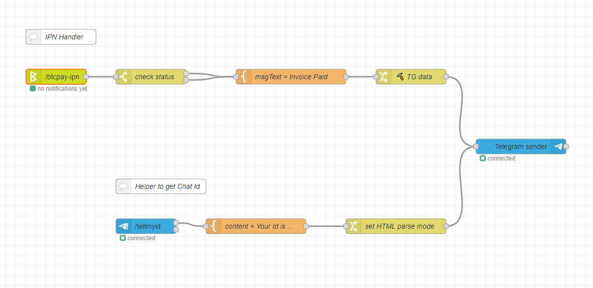

This flow will send you notifications about paid invoices using a Telegram bot.



## Prerequisites

This flow requires the following node to be installed on your Node-RED:

- [node-red-contrib-telegrambot](https://github.com/windkh/node-red-contrib-telegrambot)

## Configuration & Setup

1. Import the Node-RED Flow
2. In the "IPN Handler" section of the flow double-click the initial node and specify URL for receiving POST notifications from BTCPay Server
3. Now add the notification URL to Node-RED flows and/or other servers creating invoices for you. Calls to BTCPay's Create Invoice API should have the `notificationUrl` property with the URL you specified in the previous step
4. Open the "Configuration nodes" panel in Node-RED (via tabs on the right panel or `ctrl-g c` shortcut) and configure the config-nodes:
   - **btcpay-api-config** - create a store on your BTCPay Server and pair the node with it ([read more](https://redbtc.org/docs/configuration/))
   - **telegram bot** - [create a Telegram bot](https://core.telegram.org/bots#6-botfather) and copy/paste the token into the config-node
5. Push `Deploy`
6. Open chat with your Bot and send `/tellmyid` command
7. Copy your id
8. Double-click the "🔨 TG data" node and paste your id into `msg.payload.chatId` property
9. Push `Deploy`
10. Done! Now the bot will send you notifications about paid invoices. You might edit the notification template in the "msgText = Invoice Paid" node.

## Node-RED Flow

```json
[
    {
        "id": "3672a5c4.72a55a",
        "type": "template",
        "z": "a6bcf03.19cf21",
        "name": "msgText = Invoice Paid",
        "field": "msgText",
        "fieldType": "msg",
        "format": "handlebars",
        "syntax": "mustache",
        "template": "⚡ Invoice has been paid ⚡\n\nID: <b>{{payload.id}}</b>\nPrice: <b>{{payload.price}}</b>\nCurrency: <b>{{payload.currency}}</b>",
        "output": "str",
        "x": 610,
        "y": 280,
        "wires": [
            [
                "3fbbd85a.275e18"
            ]
        ]
    },
    {
        "id": "3fa0ab35.9e56e4",
        "type": "switch",
        "z": "a6bcf03.19cf21",
        "name": "check status",
        "property": "payload.status",
        "propertyType": "msg",
        "rules": [
            {
                "t": "eq",
                "v": "confirmed",
                "vt": "str"
            },
            {
                "t": "eq",
                "v": "complete",
                "vt": "str"
            }
        ],
        "checkall": "false",
        "repair": false,
        "outputs": 2,
        "x": 330,
        "y": 280,
        "wires": [
            [
                "3672a5c4.72a55a"
            ],
            [
                "3672a5c4.72a55a"
            ]
        ]
    },
    {
        "id": "6f9ec567.3cb2bc",
        "type": "comment",
        "z": "a6bcf03.19cf21",
        "name": "IPN Handler",
        "info": "",
        "x": 150,
        "y": 200,
        "wires": []
    },
    {
        "id": "7c969859.d52578",
        "type": "telegram sender",
        "z": "a6bcf03.19cf21",
        "name": "",
        "bot": "ac4e405.e7abcc",
        "x": 1070,
        "y": 420,
        "wires": [
            []
        ]
    },
    {
        "id": "3fbbd85a.275e18",
        "type": "change",
        "z": "a6bcf03.19cf21",
        "name": "🔨 TG data",
        "rules": [
            {
                "t": "delete",
                "p": "payload",
                "pt": "msg"
            },
            {
                "t": "set",
                "p": "payload.chatId",
                "pt": "msg",
                "to": "",
                "tot": "num"
            },
            {
                "t": "set",
                "p": "payload.type",
                "pt": "msg",
                "to": "message",
                "tot": "str"
            },
            {
                "t": "set",
                "p": "payload.options.parse_mode",
                "pt": "msg",
                "to": "HTML",
                "tot": "str"
            },
            {
                "t": "set",
                "p": "payload.content",
                "pt": "msg",
                "to": "msgText",
                "tot": "msg"
            }
        ],
        "action": "",
        "property": "",
        "from": "",
        "to": "",
        "reg": false,
        "x": 850,
        "y": 280,
        "wires": [
            [
                "7c969859.d52578"
            ]
        ]
    },
    {
        "id": "5e246e3a.b3fad",
        "type": "telegram command",
        "z": "a6bcf03.19cf21",
        "name": "",
        "command": "/tellmyid",
        "bot": "ac4e405.e7abcc",
        "strict": false,
        "hasresponse": false,
        "x": 320,
        "y": 580,
        "wires": [
            [
                "173ee6ee.2b81b9"
            ],
            []
        ]
    },
    {
        "id": "173ee6ee.2b81b9",
        "type": "template",
        "z": "a6bcf03.19cf21",
        "name": "content = Your Id is ...",
        "field": "payload.content",
        "fieldType": "msg",
        "format": "handlebars",
        "syntax": "mustache",
        "template": "Your id: <b>{{originalMessage.from.id}}</b>\n",
        "output": "str",
        "x": 540,
        "y": 580,
        "wires": [
            [
                "b808886.28c9278"
            ]
        ]
    },
    {
        "id": "b808886.28c9278",
        "type": "change",
        "z": "a6bcf03.19cf21",
        "name": "set HTML parse mode",
        "rules": [
            {
                "t": "set",
                "p": "payload.options.parse_mode",
                "pt": "msg",
                "to": "HTML",
                "tot": "str"
            }
        ],
        "action": "",
        "property": "",
        "from": "",
        "to": "",
        "reg": false,
        "x": 820,
        "y": 580,
        "wires": [
            [
                "7c969859.d52578"
            ]
        ]
    },
    {
        "id": "7ca838c0.b009a8",
        "type": "comment",
        "z": "a6bcf03.19cf21",
        "name": "Helper to get Chat Id",
        "info": "",
        "x": 350,
        "y": 500,
        "wires": []
    },
    {
        "id": "489d1a85.86dc34",
        "type": "btcpay-ipn",
        "z": "a6bcf03.19cf21",
        "client": "9711e4a7.bae348",
        "path": "/btcpay-ipn",
        "name": "",
        "x": 140,
        "y": 280,
        "wires": [
            [
                "3fa0ab35.9e56e4"
            ]
        ]
    },
    {
        "id": "ac4e405.e7abcc",
        "type": "telegram bot",
        "z": "",
        "botname": "Gatekeeper bot",
        "usernames": "",
        "chatids": "",
        "baseapiurl": "",
        "updatemode": "polling",
        "pollinterval": "300",
        "usesocks": false,
        "sockshost": "",
        "socksport": "6667",
        "socksusername": "anonymous",
        "sockspassword": "",
        "bothost": "",
        "localbotport": "8443",
        "publicbotport": "8443",
        "privatekey": "",
        "certificate": "",
        "useselfsignedcertificate": false,
        "sslterminated": false,
        "verboselogging": false
    },
    {
        "id": "9711e4a7.bae348",
        "type": "btcpay-api-config",
        "z": "",
        "name": ""
    }
]
```
